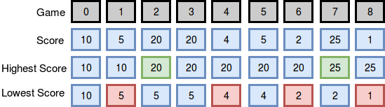

# Breaking the records

Maria plays college basketball and wants to go pro. Each season she maintains a record of her play. She tabulates the number of times she breaks her season record for most points and least points in a game. Points scored in the first game establish her record for the season, and she begins counting from there.

## Function Description

Complete the breakingRecords function in the editor below.

### breakingRecords has the following parameter(s)

```c
int scores[n]: points scored per game
Returns

int[2]: An array with the numbers of times she broke her records. Index  is for breaking most points records, and index  is for breaking least points records.
Input Format
```

The first line contains an integer , the number of games.
The second line contains  space-separated integers describing the respective values of

*score0, score1, score2, ...,  and scoren-1*

### Explanation 0

The diagram below depicts the number of times Maria broke her best and worst records throughout the season:



She broke her best record twice (after games  and ) and her worst record four times ```(after games 1, 4, 8, and 8)```, so we print `2 4` as our answer. Note that she did not break her record for best score during game , as her score during that game was not strictly greater than her best record at the time.